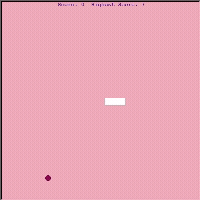

# Snake Game
A classic game built with Python’s turtle module and OOP principles.

## Features:
 - control the snake using the arrow keys;
 - eat food to grow longer;
 - colliding with walls or your own tail ends the game; 
 - real-time score track.

## Demo:

